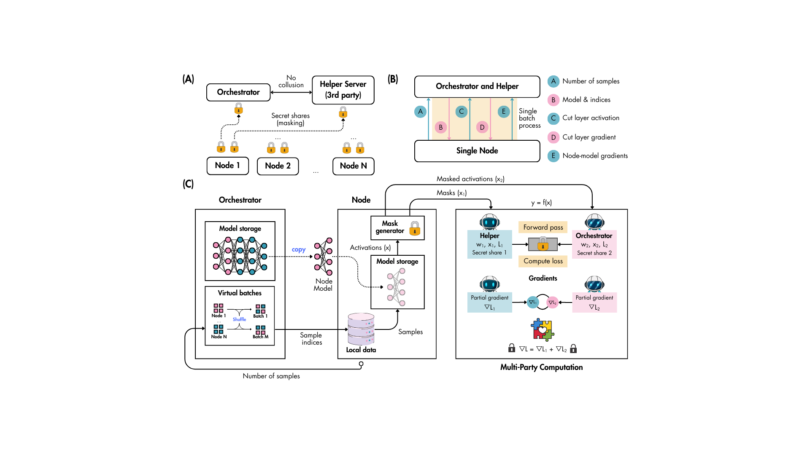

# TL++: Privacy-Preserving Traversal Learning with Secure Multiparty Computation for Distributed Intelligent Systems

TL++ is a distributed deep learning framework that enables collaborative model training across multiple low-resource edge devices (nodes) while preserving data privacy. It combines traversal and split learning strategies with secure multiparty computation (MPC) to protect sensitive intermediate activations and gradients during training.

### 🔑 Key Advantages

**Privacy-Preserving by Design**
- ✅ Raw data never leaves edge devices (nodes)
- ✅ Intermediate activations and gradients protected using secret sharing
- ✅ Semi-honest security model with non-colluding orchestrator and helper node
- ✅ Configurable privacy-utility trade-off via noise parameters

**Distributed & Efficient**
- ⚡ Splits model computation between node and orchestrator
- ⚡ Minimizes communication overhead with strategic cut points
- ⚡ Supports heterogeneous devices (GPU/CPU/MPS)
- ⚡ Robust to skewed non-IID data and heterogeneous data distributions

**Flexible Deployment**
- 🔄 Base mode for trusted environments (faster training)
- 🔒 Secure mode for privacy-critical applications (MPC-based)
- 🎯 Configurable model split points
- 🌐 Single-machine or multi-machine deployment

**Production-Ready**
- 📊 Comprehensive logging and monitoring
- 🛡️ Gradient clipping and early stopping
- 🔧 Multiple learning rate schedulers
- ⚙️ Extensive hyperparameter control

### Use Cases

- **Healthcare**: Collaborative model training across hospitals without sharing patient data
- **Finance**: Multi-institutional fraud detection while preserving transaction privacy
- **IoT**: Edge device training with bandwidth-constrained communication
- **Mobile**: On-device learning with privacy guarantees

### How It Works



### Architecture Components

**Nodes (Edge Devices)**
- Store and process local private data
- Execute bottom layers of the split model
- Send encrypted activation shares (secure mode) or activations (base mode)
- Compute gradients for local model parameters

**Orchestrator (Central Server)**
- Coordinates distributed training across all nodes
- Executes top layers of the split model
- Aggregates gradients and updates global model
- In secure mode: processes only one share, never sees raw activations

**Helper (Secure Mode Only)**
- Independent non-colluding server for MPC protocol
- Processes the second share of all activations
- Enables privacy-preserving computation without reconstruction
- Critical for maintaining privacy guarantees

## 🚀 Installation

### Prerequisites

- Python 3.8+
- PyTorch 2.0+
- torchvision
- NumPy
- tqdm

### Setup

```bash
# Clone the repository
git clone https://github.com/neouly-inc/TLplus.git
cd TLplus

# Install dependencies
pip install torch torchvision numpy tqdm

# Verify installation
python -c "import torch; print(f'PyTorch {torch.__version__}')"
```

### GPU Support (Optional)

```bash
# For NVIDIA GPUs (CUDA)
pip install torch torchvision --index-url https://download.pytorch.org/whl/cu118

# For Apple Silicon (MPS) - PyTorch 2.0+ includes MPS support
# No additional installation needed
```

## ⚡ Quick Start

### 1. Base Mode (Single Machine)

Train with 3 nodes on a single machine:

```bash
# Terminal 1: Start orchestrator
python orchestrator.py --n_nodes 3 --cut_layer 1

# Terminal 2: Start node 1
python node.py

# Terminal 3: Start node 2
python node.py

# Terminal 4: Start node 3
python node.py
```

### 2. Secure Mode (Single Machine)

Train with privacy-preserving MPC:

```bash
# Terminal 1: Start orchestrator
python orchestrator.py --n_nodes 2 --cut_layer 1 --secure

# Terminal 2: Start helper
python helper.py --n_nodes 2

# Terminal 3: Start node 1
python node.py --secure

# Terminal 4: Start node 2
python node.py --secure
```

## 📘 Base Mode

Base mode provides direct communication between orchestrator and nodes without privacy protection. Suitable for trusted environments.

### Basic Usage

#### Start Orchestrator

```bash
python orchestrator.py \
  --n_nodes 3 \
  --cut_layer 1 \
  --epochs 200 \
  --train_batch_size 128 \
  --lr 0.1
```

#### Start Nodes

```bash
# Each node automatically connects and receives configuration
python node.py --host 127.0.0.1 --port 8080
```

### Distributed Setup (Multiple Machines)

#### On Server (Orchestrator)

```bash
python orchestrator.py \
  --host 0.0.0.0 \
  --port 8080 \
  --n_nodes 3
```

#### On Edge Devices (Nodes)

```bash
# Replace SERVER_IP with orchestrator's IP address
python node.py --host SERVER_IP --port 8080
```

### Cut Layer Selection

Choose where to split the model:

- **Cut Layer 1** (Recommended): Minimal communication, faster training
  - Node: 64 channels (16×16 feature maps)
  - Best for: Bandwidth-constrained scenarios

- **Cut Layer 2**: Balanced computation
  - Node: 128 channels (8×8 feature maps)
  - Best for: Medium network bandwidth

- **Cut Layer 3**: Maximum privacy (more computation on node)
  - Node: 512 features (fully connected)
  - Best for: Privacy-sensitive applications

```bash
# Example: Use cut layer 2
python orchestrator.py --cut_layer 2 --n_nodes 3
```

## 🔒 Secure Mode

Secure mode uses multi-party computation (MPC) with additive secret sharing to protect intermediate activations. Requires a helper server.

### Security Model

- **Threat Model**: Semi-honest (honest-but-curious) adversaries
- **Assumption**: Orchestrator and helper do not collude
- **Protection**: Intermediate activations never reconstructed

### Setup

#### 1. Start Orchestrator

```bash
python orchestrator.py \
  --secure \
  --n_nodes 2 \
  --host 0.0.0.0 \
  --port 8080 \
  --helper_host 0.0.0.0 \
  --helper_port 8082
```

#### 2. Start Helper Server

```bash
python helper.py \
  --n_nodes 2 \
  --host 0.0.0.0 \
  --port 8081 \
  --orch_host ORCHESTRATOR_IP \
  --orch_port 8082
```

#### 3. Start Nodes

```bash
python node.py \
  --secure \
  --orch_host ORCHESTRATOR_IP \
  --orch_port 8080 \
  --helper_host HELPER_IP \
  --helper_port 8081
```

## ⚙️ Configuration

### Orchestrator Options

```bash
python orchestrator.py --help
```

**Network:**
- `--host`: Bind address (default: 127.0.0.1)
- `--port`: Port for nodes (default: 8080)
- `--secure`: Enable secure mode
- `--helper_host`: Helper host (secure mode, default: 127.0.0.1)
- `--helper_port`: Helper port (secure mode, default: 8082)

**Secure Mode Privacy:**
- `--activation_noise`: Noise scale for activations (default: 0.02 = 2%)
- `--gradient_noise`: Noise scale for gradients (default: 0.10 = 10%)

**Model:**
- `--cut_layer`: Split point [1, 2, 3] (default: 1)
- `--n_nodes`: Number of nodes (default: 1)

**Training:**
- `--epochs`: Training epochs (default: 200)
- `--train_batch_size`: Batch size (default: 128)
- `--test_batch_size`: Test batch size (default: 256)
- `--patience`: Early stopping patience (default: 30)

**Optimizer:**
- `--lr`: Learning rate (default: 0.1)
- `--momentum`: SGD momentum (default: 0.9)
- `--weight_decay`: L2 regularization (default: 5e-4)
- `--nesterov` / `--no_nesterov`: Nesterov momentum

**Scheduler:**
- `--scheduler`: [cosine, step, multistep] (default: cosine)
- `--t_max`: Cosine T_max (default: epochs)
- `--eta_min`: Cosine min LR (default: 1e-6)
- `--step_size`: Step scheduler size (default: 50)
- `--gamma`: Decay factor (default: 0.1)
- `--milestones`: MultiStep milestones (default: [60, 120, 160])

**Regularization:**
- `--grad_clip_norm`: Gradient clipping (default: 1.0, 0=disabled)

**Hardware:**
- `--no_accel`: Force CPU only

### Node Options

```bash
python node.py --help
```

**Base Mode:**
- `--host`: Orchestrator host (default: 127.0.0.1)
- `--port`: Orchestrator port (default: 8080)

**Secure Mode:**
- `--secure`: Enable secure mode
- `--orch_host`: Orchestrator host (default: 127.0.0.1)
- `--orch_port`: Orchestrator port (default: 8080)
- `--helper_host`: Helper host (default: 127.0.0.1)
- `--helper_port`: Helper port (default: 8081)

**Hardware:**
- `--no_accel`: Force CPU only

### Helper Options

```bash
python helper.py --help
```

- `--n_nodes`: Expected number of nodes (required)
- `--host`: Bind address for nodes (default: 127.0.0.1)
- `--port`: Port for nodes (default: 8081)
- `--orch_host`: Orchestrator host (default: 127.0.0.1)
- `--orch_port`: Orchestrator coordination port (default: 8082)

## 📝 License

This project is licensed under the MIT License.